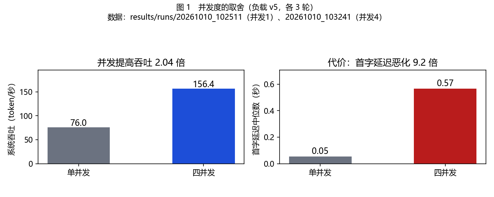
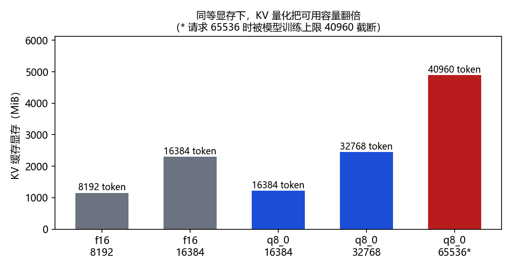
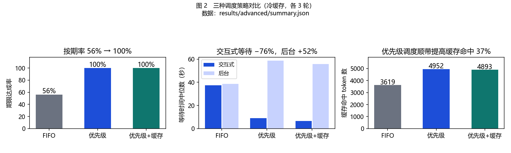

# 本地大模型推理服务：部署、测量、优化与调度

**ANTHub Infra 方向考核报告（基础阶段 + 进阶阶段）**

| 项目 | 内容 |
| --- | --- |
| 仓库 | `https://github.com/zouyuhang080926/ANTLab-Infra-Tasks` |
| 最终分支 | `master` |
| 完成日期 | 2026-10-10 |
| 报告位置 | `Basic Task/development/reports/report.md` |

---

## 1. 完成概览

### 1.1 选择题号与交付

基础阶段全部完成；进阶阶段选择**自主探索方向**，实现"缓存感知的请求调度"，
并在此过程中改成了以**优先级调度**为核心（原因见第 8 节）。

### 1.2 完成与未完成

| 项目 | 状态 | 证据 |
| --- | :-: | --- |
| WSL 中 llama.cpp GPU 推理 | ✅ | `configs/env.md`、`results/d1_evidence/` |
| 计算层与 KV 在 GPU 的证据 | ✅ | 同上 |
| 固定负载与场景定义 | ✅ | `configs/scenario.md`、`configs/workload.json` |
| 指标口径 | ✅ | `configs/metrics.md` |
| 压测程序（单/多并发、多轮、流式） | ✅ | `src/runner.py` |
| 首版基线（单并发 + 四并发各 3 轮） | ✅ | `results/runs/` |
| 配置级优化对比 | ✅ | `results/optimization/` |
| KV 容量测量 | ✅ | `results/optimization/kv_capacity.txt` |
| 输出质量核查 | ✅ | `results/quality_check/` |
| 错误记录与服务恢复 | ✅ | `results/fault_test/` |
| 前端展示 | ✅ | `src/frontend.py`、`src/web/index.html` |
| 进阶题：请求调度 | ✅ | `src/scheduler.py`、`src/replay.py`、`results/advanced/` |
| **KV 量化对输出质量的影响** | ❌ **未测** | 见 9.4 与 12.2 |
| **并发下的调度行为** | ❌ **未测** | 调度实验为串行，见 8.4 |
| **更高并发（8/10）** | ❌ **未测** | 见 12.2 |

### 1.3 最值得核验的三个结果

| # | 结果 | 数据路径 |
| :-: | --- | --- |
| 1 | 四并发使系统吞吐提高 2.04 倍，代价是首字延迟恶化 9.2 倍 | `results/runs/20261010_102511.jsonl`（并发1）、`20261010_103241.jsonl`（并发4） |
| 2 | KV 量化在同等显存下把可用容量从 16384 翻倍到 32768 token | `results/optimization/kv_capacity.txt` |
| 3 | 优先级调度使期限达成率从 56% 提升到 100% | `results/advanced/summary.json` |

---

## 2. 应用场景与问题

### 2.1 场景

一个 **8 人的小型工作室**，同时存在办公类与编程类需求。

| 项目 | 设定 | 依据 |
| --- | --- | --- |
| 规模 | 8 人 | 考核要求"不超过 10 人"，题包素材本身按小型工作室编写 |
| 任务构成 | 办公 6 : 编程 4 | **直接取自题包 10 条规定任务的构成**，非人为设定 |
| 请求长度 | 短（纯提示词）／中（附代码）／长（附文档） | 见 `configs/scenario.md` 第三节 |
| 到达方式 | 交互式（人在等）＋后台批处理（可等待） | — |

### 2.2 要解决的问题

1. 在**一台 12GB 显存的笔记本**上部署可用的本地推理服务；
2. 建立一套**可复现的测量方法**，能回答"改动到底有没有用"；
3. 找出**真正有效的优化**，并量化其代价；
4. 验证系统在**故障**下能否恢复；
5. 在**多用户竞争**时，怎样安排处理顺序对业务最有利。

### 2.3 硬件约束的前提

显存只有 12227 MiB，而模型权重占 2375.91 MiB。
**所有容量与并发决策都必须围绕这个上限做算术**，这是本项目一切取舍的起点。

---

## 3. 环境与复现条件

| 项目 | 信息 |
| --- | --- |
| GPU | NVIDIA GeForce RTX 5070 Ti Laptop GPU，12227 MiB，计算能力 12.0（Blackwell / sm_120） |
| 驱动 | 610.62 |
| CPU / 内存 | AMD Ryzen 9 8940HX（16 核 32 线程）／主机 31.2 GB，WSL 上限配置 24 GB |
| Windows / WSL / Linux | WSL2 + Ubuntu 22.04，内核 6.18.40.1-microsoft-standard-WSL2 |
| CUDA | 13.4 |
| llama.cpp | 0.6.0-dev，源码 commit `d8880160413fc77f63d6a73a5b1ac21ac65e36e1` |
| 构建参数 | `cmake -DGGML_CUDA=ON -DCMAKE_CUDA_ARCHITECTURES=120` |
| 模型 | Qwen3-4B，GGUF，Q4_K_M，2497280256 字节 |
| 模型 SHA256 | `7485fe6f11af29433bc51cab58009521f205840f5b4ae3a32fa7f92e8534fdf5` |
| 模型来源 | https://huggingface.co/Qwen/Qwen3-4B-GGUF（与上游大小及 SHA256 一致） |
| 模型权重与计算位置 | 全部在 GPU（`offloaded 37/37 layers to GPU`） |
| 上下文 / 输出预算 / slot | `-c 16384` / 逐任务 512~6144 / `n_slots = 4`（`kv_unified = true`） |
| KV 类型与位置 | f16（基线）／q8_0（优化后），均在 CUDA0 |

环境详情见 `configs/env.md`；每次运行的环境快照见 `results/runs/<run_id>.env.json`。

### 3.1 环境控制（踩过的坑）

| 现象 | 原因 | 处理 |
| --- | --- | --- |
| 性能突然只有 1/3 | 笔记本在**电池供电**，显卡被限制到 277 MHz | 测量前必须插电 |
| 短测速结果远低于预期 | 显卡需 6~8 秒才升到高频 | 运行器内置预热 |
| 出现**负的首字延迟** | 用了 `time.time()`（墙上时钟会被校时拉动） | 改用 `time.monotonic()` |

运行器已把这些固化为自动行为，并在每次运行时记录显卡状态快照。

---

## 4. 系统设计与实现

### 4.1 结构

```
浏览器 ──▶ 前端展示服务（src/frontend.py，端口 8000）
                │  读取
                ▼
        results/runs/*.jsonl          运行原始记录
                ▲
                │ 写入
压测程序（src/runner.py）──▶ llama-server（端口 8888）
                │                    ▲
                │                    │ 服务管理
                └──▶ 调度模块 ────────┘
                    （src/scheduler.py + src/replay.py）

服务管理：src/supervisor.py（健康检测 / 重启 / 就绪确认 / 事件时间线）
质量核查：src/check_quality.py
```

### 4.2 关键模块

| 文件 | 职责 | 关键设计 |
| --- | --- | --- |
| `src/runner.py` | 固定负载压测 | 路径由自身位置推算；流式测量 TTFT；成功与失败都落盘；每写一行即 flush |
| `src/supervisor.py` | 服务管理 | 用 `/health` 而非进程存在性判断可用；重启后必须**确认就绪**才算恢复 |
| `src/fault_test.py` | 故障实验 | 运行途中直接杀进程；三类请求分别处理 |
| `src/check_quality.py` | 输出质量核查 | **不同任务用不同合格标准**（见 9.1） |
| `src/scheduler.py` | 请求调度 | 纯规则查表，决策开销可忽略 |
| `src/replay.py` | 调度回放 | 每轮重启服务清空缓存，保证起点一致 |
| `src/frontend.py` | 展示界面 | 只用标准库；统计在服务端算好，避免两处算法不一致 |

### 4.3 一次请求的可追溯链

从界面或汇总表任取一个数字，可按以下路径追到源头：

```
汇总数字 → results/runs/<run_id>.jsonl 的一条记录
         → record.request_id（哪一轮哪条任务）
         → record.file + record.file_sha256（用了哪份资料）
         → record.answer（模型原话）
         → record.server_timings（服务端各阶段耗时）
         → configs/workload.json（该任务的输入与参数）
         → results/runs/<run_id>.env.json（当时的显卡状态）
```

---

## 5. 测试负载与判定依据

### 5.1 固定负载

10 条规定任务，出自题包，**提示词与题包原文逐字一致**（生成脚本自动校验）。

| 编号 | 任务 | 类型 | 模式 | 输出预算 | 关联资料 |
| --- | --- | --- | --- | ---: | --- |
| P01 | 办公邮件 | 办公 | 交互 | 512 | — |
| P02 | 工作计划 | 办公 | 交互 | 2048 | — |
| P03 | 编程实现 | 编程 | 交互 | 6144 | — |
| P04 | 程序设计 | 编程 | 交互 | 2048 | — |
| D01 | 会议与进度整理 | 办公 | 后台 | 2048 | 办公输入01（3128 字符） |
| D02 | 客户沟通 | 办公 | 后台 | 1536 | 办公输入01 |
| D03 | 制度问答 | 办公 | 交互 | 1536 | 办公输入02（2723 字符） |
| D04 | 入职清单 | 办公 | 后台 | 2048 | 办公输入02 |
| C01 | 代码审查 | 编程 | 后台 | 3072 | 编程输入03（4105 字符） |
| C02 | 代码修复与测试 | 编程 | 后台 | 4096 | 编程输入03 |

定义文件：`configs/workload.json`（版本 v5，含源文件 SHA256）。

### 5.2 输出预算的确定过程（负载 v1 → v5）

**预算不能靠猜。** 实测发现初版预算导致大量截断：

| 版本 | 改动 | 结果 |
| --- | --- | --- |
| v1 | 初始设定 | 5/10 条任务被截断 |
| v2 | 提高 P02/P03/P04/C01/C02 | 仍有残留 |
| v3 | 依据 158 条记录统计再调 | P03 在 2560 下仍截断 2/3 轮 |
| v4 | P03→4096、C02→6144 | 四并发下仍有 1/6 截断 |
| **v5** | P03→6144 | **0 截断** |

**关键认识**：P03 的输出长度在 856~4096+ token 之间大幅波动（差 5 倍）。
即使 `temperature=0`，输出也非完全确定——批处理组合与缓存状态不同时，
浮点累加的差异会在边界上翻转选择。**因此"固定输出上限"必须按分布的长尾设定。**

### 5.3 判定依据

| 任务类型 | 合格标准 | 为什么 |
| --- | --- | --- |
| P03、C02 | 代码可以**实际运行**通过 | 任务要求"完整可用的实现" |
| P04 | 通过**语法检查** | 任务只要求"方案 + 核心代码示例" |
| C01 | 检查**问题覆盖** | 任务要求"指出问题"，产出是复现片段 |
| D03、D04 | 引用编号**必须在原文中真实存在** | 制度问答的核心要求是准确引用 |

**用统一标准要求这四类任务会产生大量假失败**——本项目的核查工具第一版就犯了这个错
（把 C01 的 10 个缩进片段拼成一个文件执行，报 `IndentationError`），
修正后才得到可用结论。

---

## 6. 基线与指标

指标定义见 `configs/metrics.md`，要点：

| 指标 | 定义 | 测量位置 |
| --- | --- | --- |
| TTFT | 从发起请求到收到**第一个非空内容分片** | 客户端（流式） |
| 总耗时 | 从发起请求到收到 `[DONE]` | 客户端 |
| TPOT | (总耗时 − TTFT) ÷ (输出 token 数 − 1) | 客户端计算 |
| 系统吞吐 | 总输出 token ÷ **墙钟时间** | 客户端 |
| KV 容量 | 以 token 计，区分配置值与实测值 | 配置 + 加载日志 |

**两个容易算错的地方**（本项目均踩过）：

1. **吞吐的分母必须是墙钟时间**，不能用"各请求耗时之和"——后者在并发时
   会把 2.3 倍的收益算成负收益；
2. **只认非空内容分片**作为首字，HTTP 响应头不算。

---

## 7. 开发与优化过程

| 改动 | 问题与目标 | 配置变化 | 预期 | 实际结果 | 决定 |
| --- | --- | --- | --- | --- | --- |
| 1 | KV 池不足以支撑四并发长文档 | `-c 8192` → `16384` | 消除容量超限 | 四并发由失败转为 30/30 成功 | **保留** |
| 2 | 输出预算过紧导致截断 | 见 5.2（v1→v5） | 消除截断 | 截断由 15 次降至 0 | **保留** |
| 3 | 提升系统吞吐 | 并发 1 → 4 | 吞吐上升 | 吞吐 76.7 → 156.4 t/s；TTFT 0.06 → 0.55 s | **保留** |
| 4 | 尝试 Flash Attention | 加 `-fa on` | 更快更省显存 | 吞吐 **−4.4%**，显存 **+603 MiB** | **不保留** |
| 5 | 提高 KV 容量 | 加 `-ctk q8_0 -ctv q8_0` | 容量翻倍、速度略降 | 容量 16384→32768；吞吐 −6.4% | **保留** |

### 7.1 关于第 5 项的决定依据

该项目场景以长文档任务为主，**容量不足会导致请求直接失败**（已在 `-c 8192`
时实测到 `Context size has been exceeded`），而 6.4% 的吞吐下降
在 0.06 秒的首字延迟上不可感知。

**在"失败"和"慢一点"之间选择后者。**

### 7.2 三项关键决定

| # | 决定 | 当时依据 | 其他选择 | AI 的影响 | 核验方式 |
| :-: | --- | --- | --- | --- | --- |
| 1 | 固定负载的输出预算按长尾设定 | 实测 P03 输出波动达 5 倍 | 压低预算换取速度 | AI 建议先测分布再定值 | 重跑后 `finish_reason` 全为 `stop` |
| 2 | 保留 KV 量化、放弃 Flash Attention | 实测两者都是速度负收益，但 KV 量化换来容量翻倍 | 全保留／全放弃 | AI 提出对比框架，**结论由实测推翻其预期** | A-B-A 重跑排除设备漂移 |
| 3 | 调度实验每轮重启服务 | 发现"首次出现"的请求也命中 99% 缓存 | 接受污染数据 | **AI 未察觉，由数据异常反向暴露** | 清空缓存后三种策略差异才显现 |

---

## 8. 结果与分析

### 8.1 基线：并发度的取舍



| 配置 | 运行编号 | TTFT 中位 | 总耗时中位 | 墙钟 | 吞吐 | 成功 |
| --- | --- | ---: | ---: | ---: | ---: | :-: |
| 并发 1 | `20261010_102511` | 0.05 s | 11.97 s | 447.9 s | 76.0 t/s | 30/30 |
| 并发 4 | `20261010_103241` | 0.55 s | 16.22 s | 237.3 s | **156.4 t/s** | 30/30 |
| 并发 1（复核） | `20261010_113336` | 0.06 s | 12.34 s | 508.7 s | 76.7 t/s | 30/30 |

**吞吐提升 2.06 倍；首字延迟恶化 10.4 倍。**

对 8 人工作室的场景，0.55 秒的首字延迟人无法感知，因此这个交换是划算的。

### 8.2 配置级优化对比

| 配置 | 运行编号 | 吞吐 | 相对基线 | 显存 |
| --- | --- | ---: | ---: | ---: |
| A 基线 | `20261010_110527` | 76.7 t/s | — | 7619 MiB |
| B Flash Attention | `20261010_111401` | 73.3 t/s | −4.4% | 8222 MiB |
| C KV q8 | `20261010_112300` | 71.8 t/s | −6.4% | 7022 MiB |
| **A2 基线复核** | `20261010_113336` | **76.7 t/s** | **0%** | — |

**采用 A-B-A 设计**：三次运行吞吐恰好单调下降（76.7→73.3→71.8），
环境快照显示第一次运行从 64 °C 起步、后两次从 79~80 °C 起步，
怀疑是设备热漂移。**重跑基线得到 76.7 t/s，与第一次一致**，
从而排除漂移、确认差异来自配置本身。

**这一步的价值**：若不排除，可能把设备状态变化误判为配置效果。

### 8.3 KV 容量



| KV 精度 | `-c` | 实际生效 | KV 显存 | 模型显存 |
| :-: | ---: | ---: | ---: | ---: |
| f16 | 8192 | 8192 | 1152 MiB | 2375.91 MiB |
| f16 | 16384 | 16384 | 2304 MiB | 2375.91 MiB |
| q8_0 | 16384 | 16384 | 1224 MiB | 2375.91 MiB |
| **q8_0** | **32768** | **32768** | **2448 MiB** | 2375.91 MiB |
| q8_0 | 65536 | **40960** | 4896 MiB | 2375.91 MiB |

**显存只增加 6%，可用容量翻倍。** 容量存在硬上限 40960（模型训练上下文），
继续增大参数不会突破。

### 8.4 进阶题：请求调度



负载为题包提供的 16 条固定请求序列（8 交互式 + 8 后台），
三种策略各 3 轮，**每轮开始前重启服务清空缓存**。

| 策略 | 按期率 | 交互等待中位 | 后台等待中位 | 后台最大等待 | 缓存命中 |
| --- | ---: | ---: | ---: | ---: | ---: |
| FIFO | 56% | 37.5 s | 38.6 s | 70.3 s | 3619 |
| **priority** | **100%** | **9.0 s** | 58.7 s | 79.2 s | **4952** |
| priority_cache | 100% | 6.7 s | 55.8 s | 72.5 s | 4893 |

**结论一：优先级调度是决定性的。** 按期率 56%→100%，交互式等待降低 76%。

**结论二：代价明确且可接受。** 后台等待延长 52%，但其期限为 180~240 秒，
**按期率并未下降**——用户看不见的等待变长，用户看得见的等待变短。

**结论三：缓存亲和规则没有额外收益（与预测不符）。**
`priority_cache` 的缓存命中 4893，反而略低于 `priority` 的 4952。

**原因已定位**：`R08` 是交互式请求，优先级规则本来就把它紧排在同会话的
`R01` 之后，缓存亲和**没有可优化空间**。

**一个未预期的发现**：优先级调度本身把缓存命中提高了 37%（3619→4952）。
逐请求数据揭示了机制：

| 策略 | R01（会话首条） | R08（同会话第二条） |
| --- | ---: | ---: |
| FIFO | 0 | **0**（中间隔 6 条请求，超过 4 个 slot，前缀被挤出） |
| priority | 0 | **774**（紧接 R01，前缀仍在） |

> **前缀复用能否命中，取决于同一前缀的后续请求是否在前缀被挤出之前得到处理。**
> 调度顺序直接决定缓存的可得性。

**这条规律也解释了为什么"缓存亲和"作为独立机制收效甚微**——
当优先级规则已把相关请求聚拢时，缓存收益是自动获得的副产品。

**最终决定：采用优先级调度，不叠加缓存亲和规则。**
保留一个没有收益的机制只会让系统更难维护和解释。

### 8.5 失败与取消的处理

所有失败与截断均保留在原始记录中，未做覆盖。

| 运行 | 现象 | 保留位置 |
| --- | --- | --- |
| `20261010_212420`、`20261010_212519` | 四并发长文档导致 KV 池超限，出现空回答与截断响应 | `results/runs/` |
| `20261010_210937`、`211334`、`211837` 等 | 输出预算不足导致的截断 | 同上 |

---

## 9. 输出效果、边界与恢复

### 9.1 输出质量核查

数据：`results/quality_check/`；结论：`results/quality_check/核查结论.md`。
两次独立运行结论一致。

| 检查项 | 结果 |
| --- | --- |
| 条款引用真实性（D03/D04，12 轮） | ✅ **0 处编造**，引用的编号全部存在于原文 |
| 问题覆盖度（C01，6 轮） | ⚠️ 稳定覆盖 4/6，**"平均耗时算法"六轮均未提到** |
| 函数与测试（P03，6 轮） | ✅ 全部**实际运行通过** |
| 方案代码（P04） | ✅ 语法正确 |
| 修复与自测（C02，6 轮） | ❌ **全部未通过** |

**最有价值的发现**：同一模型在 C01 中正确识别"id 去重逻辑不正确"并给出修复建议，
但在 C02 中产出的程序**仍然没有去重**，且记录缺失 `id` 字段时抛 `KeyError`
（约定要求跳过）。

**能诊断，不能修。** 这说明"识别缺陷"与"实现修复"是两种能力，
不能因为前者通过就假定后者通过。对场景的影响是直接的：
重复工单会被重复计数、脏数据会让程序崩溃。

### 9.2 边界

| 边界 | 现象 | 处理 |
| --- | --- | --- |
| KV 容量 | `-c 8192` 四并发长文档时报 `Context size has been exceeded` | 提升到 16384；或改用 KV 量化在同等显存下翻倍 |
| 上下文硬上限 | 请求 65536 实际只得到 40960 | 记录，不再尝试突破 |
| 输出长度波动 | P03 输出在 856~4096+ 之间波动 | 按长尾设定预算 |
| 并发与延迟 | 并发 4 时 TTFT 恶化 10 倍 | 量化后按场景取舍 |

### 9.3 服务故障与恢复

实现：`src/supervisor.py`、`src/fault_test.py`；结论：`results/fault_test/结论.md`。

三类请求的处理方式：

| 类别 | 定义 | 处理 | 计数 |
| --- | --- | --- | --- |
| 等待中 | 尚未发出 | 等服务恢复再发，**不消耗重试次数** | 不计失败 |
| 已发送 | 已发出但未收到完整响应 | 计一次尝试，按上限重试 | 按 `request_id` 去重 |
| 失败 | 重试耗尽或等待超时 | 标记 `failed` | **计入分母** |

三个实验：

| 实验 | 运行编号 | 故障时机 | 自动重启 | 结果 |
| :-: | --- | --- | :-: | --- |
| 1 | `20261010_104749` | 请求发出前 | 开 | 10/10 成功，无重试 |
| 2 | `20261010_105010` | 请求执行途中 | 开 | 10/10 成功，**1 条经重试恢复** |
| 3 | `20261010_110039` | 请求执行途中 | 关 | 3/10 成功，**7 条失败** |

```
异常检出到恢复完成：2.5 ~ 3.0 秒
已发送请求的重试恢复：1 次重试即成功
记录去重：11 次尝试 → 10 条记录
恢复后独立验证：通过
```

### 9.4 未检查的部分（如实列出）

1. **KV 量化对输出质量的影响未测。** 量化会改变数值，
   且 C 组出现 1 次截断（基线 0 次），提示输出可能受影响。**这是明确缺口**；
2. **并发下的调度行为未测。** 调度实验为串行处理，用于隔离"顺序"这一变量；
3. **恢复耗时是理想条件下的结果。** 模型仅 2.4GB 且在页缓存中，
   重启仅需 1.5~4.3 秒；冷加载时 20 秒等待预算可能不足；
4. **未验证恢复期间的数据一致性**（中途断开的请求是否在服务端留下半截状态）；
5. **重试未加退避**，固定间隔 5 秒，服务刚恢复时可能造成瞬时压力。

---

## 10. 前端与演示


界面：`src/frontend.py` + `src/web/index.html`，启动方式 `python3 src/frontend.py`，
浏览器访问 `http://localhost:8000`。

**技术选择：只用 Python 标准库与原生 HTML/JS，不引入任何框架。**
理由是评委拿到仓库即可运行，无需 `npm install`。

| 区块 | 内容 |
| --- | --- |
| ① 服务状态 | 推理服务在线/离线、显卡温度/频率/功耗/显存、`/metrics` 原始指标 |
| ② 运行列表 | 13 次运行：编号、轮次、并发、成功数、吞吐；**有失败或截断的整行标红** |
| ③④⑤ 运行详情 | 汇总指标 + 逐任务表 + 逐请求记录（**模型原始输出可展开查看**） |
| ⑥ 基线对比 | 选两次运行并排比较，自动计算吞吐与 TTFT 的变化倍数 |

统计在服务端计算后传给前端，避免两处算法不一致。

---

## 11. AI 辅助开发、开源来源与 Git

### 11.1 AI 使用申报

| 项目 | 内容 |
| --- | --- |
| 推理模型 | Qwen3-4B（GGUF，Q4_K_M），本地部署，非云 API |
| AI 辅助工具与用途 | 用于环境搭建排错、代码评审、实验设计讨论、文档整理 |
| Token 消耗量级 | 本地推理，无外部 API 计费；运行器已记录每次请求的输入/输出 token 数（见 `results/runs/`） |
| 本人核验的关键判断 | 见下 |
| 未实现/未运行/未验证 | 见 1.2 与 9.4 |

### 11.2 关键判断的核验方法

| 判断 | AI 的影响 | 核验方式 |
| --- | --- | --- |
| 输出预算按长尾设定 | AI 建议先测分布 | 重跑后用 `finish_reason` 检查是否全为 `stop` |
| Flash Attention 是负优化 | **实测推翻了 AI 的预期** | A-B-A 重跑排除漂移 |
| KV 量化容量翻倍 | AI 提出思路 | 从服务端加载日志读取 `KV buffer size` 实测 |
| 调度收益来自优先级而非缓存亲和 | AI 最初预测缓存亲和有效 | 逐请求 `cached_tokens` 定位到 R08 的机制 |
| 缓存实验需每轮清空缓存 | **AI 未察觉**，由数据异常反向暴露 | 重启服务后三种策略差异才显现 |
| 代码修复任务的合格判定 | AI 建议直接跑模型自测 | **改回题包给定的功能约定**作为外部标准 |

**重要说明**：AI 在本项目中既有帮助也有误导。
上表中有两项（第 2、5 行）是**实测与 AI 预期相反**，
另有一项（第 6 行）是核查工具第一版由 AI 设计、产生了大量假失败，修正后才可用。

### 11.3 开源来源

| 项目 | 版本 / 来源 | 用途与本项目改动 |
| --- | --- | --- |
| llama.cpp | 0.6.0-dev，commit `d8880160…`（`https://github.com/ggml-org/llama.cpp`） | 推理引擎。**未修改引擎源码**，仅使用其 `llama-server` / `llama-bench` 与启动参数 |
| 题包骨架 | `ANTLab-Infra-Tasks` 原始 commit | 目录结构与素材；本项目在其 `development/` 下自行实现全部源码 |
| Qwen3-4B GGUF | `Qwen/Qwen3-4B-GGUF` | 模型权重；未修改 |

除上表外，本项目的全部源码（`src/` 下 9 个文件）为自行实现，
未使用第三方 Python 库（`check_quality.py` 调用系统的 `pytest` 运行模型生成的测试）。

### 11.4 Git

提交按功能组织，每条提交对应一个可独立理解的工作单元：

| 提交 | 内容 |
| --- | --- |
| `08b451f` | 搭建 WSL CUDA 版 llama.cpp，首次 GPU 推理与基线采集 |
| `865d550` | 冷启动/预热样本与证据索引 |
| `c14458b` | 基线端口改为 8888，补充端口冲突说明 |
| `9e6976b` | 指标口径、流式 TTFT、多轮次与并发；KV 池容量边界 |
| `372aa3a` | 输出质量核查 |
| `2ee1d97` | 前端展示界面 |
| `501f212` | 服务管理与故障恢复实验 |
| `1986c10` | 配置级优化对比 |
| `ce8601c` | 进阶题：请求调度模块与三策略对比 |

---

## 12. 总结与复现索引

### 12.1 结论

1. **在 12GB 显存的笔记本上可以跑起可用的本地推理服务**，
   但在四并发处理长文档时会撞到 KV 容量边界，需提前按算术规划；
2. **并发是本项目最有效的吞吐手段**（2.04 倍），代价是首字延迟恶化；
   这一取舍对"8 人工作室"的场景是划算的；
3. **KV 量化是容量优化的核心手段**：显存仅增加 6%，可用容量翻倍，
   速度下降 6.4%。**Flash Attention 在本机上是负优化**；
4. **调度顺序决定缓存的可得性**：同一前缀的后续请求若在前缀被挤出
   （受 slot 数限制）之前未被处理，缓存复用无从发生；
5. **模型的"识别能力"与"修复能力"不等价**：
   同一模型能正确指出 id 去重缺陷，却在修复任务中未落实该修复。

### 12.2 下一步值得验证的

| # | 问题 | 为什么重要 |
| :-: | --- | --- |
| 1 | **KV 量化对输出质量的影响有多大？** | 收益已确认，代价未量化，是当前最大的未知 |
| 2 | **并发下的调度行为是否与串行一致？** | 本实验串行以隔离变量，实际部署必然并发 |
| 3 | **slot 数与调度策略如何交互？** | 8.4 节的机制推断指出 slot 数决定缓存保留，未做交叉实验 |
| 4 | **8/10 并发时系统在哪个点饱和？** | 当前只测到并发 4 |
| 5 | **用决策模型判断优先级的开销是否可接受？** | 本实验用规则，未测模型判断的代价 |

### 12.3 复现索引

```bash
# 环境（详见 configs/env.md）
/root/work/llama.cpp/build/bin/llama-server \
  -m /root/work/models/Qwen3-4B-Q4_K_M.gguf \
  -ngl 99 -c 16384 --host 0.0.0.0 --port 8888 -cram 0 --metrics

# 固定负载与基线（基础阶段主实验）
cd "Basic Task/development"
python3 src/runner.py            # 输入核查（dry-run）
python3 src/runner.py run 3 1    # 3 轮单并发
python3 src/runner.py run 3 4    # 3 轮四并发

# 输出质量核查
python3 src/check_quality.py <运行编号>

# 故障与服务恢复
python3 -u src/fault_test.py                  # 自动重启
python3 -u src/fault_test.py --no-restart     # 验证重试耗尽

# 配置级优化对比
python3 src/compare_optimization.py

# 进阶题：请求调度（每轮自动清空缓存）
python3 -u src/replay.py all 3

# 前端展示
python3 src/frontend.py          # 浏览器打开 http://localhost:8000

# 报告配图
python3 src/make_figures.py
```

| 数据 | 位置 |
| --- | --- |
| 环境实况 | `configs/env.md` |
| 场景定义 | `configs/scenario.md` |
| 固定负载 | `configs/workload.json` |
| 指标口径 | `configs/metrics.md` |
| 基线原始记录 | `results/runs/*.jsonl` + `*.env.json` |
| 优化对比 | `results/optimization/` |
| 质量核查 | `results/quality_check/` |
| 故障恢复 | `results/fault_test/` |
| 调度实验 | `results/advanced/` |
| 报告配图 | `reports/figures/` |
